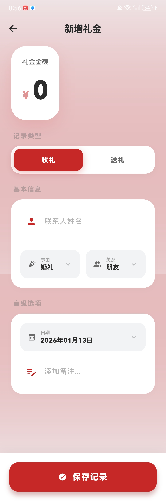
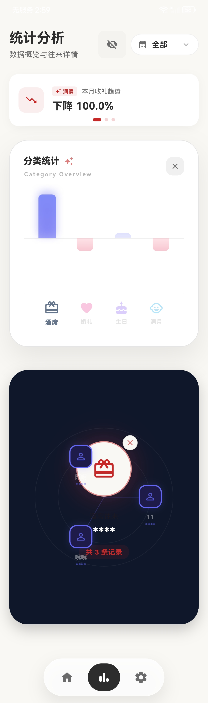
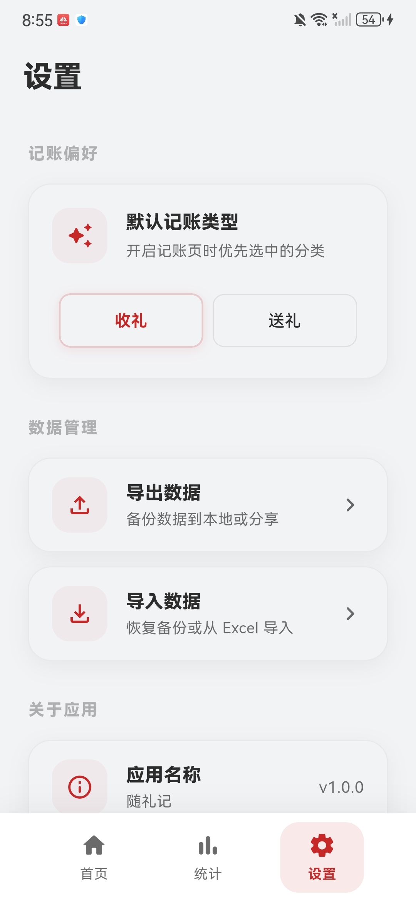

# 📱 随礼记 - 礼金收支追踪管理

一款简洁优雅的礼金收支管理应用，帮助你轻松记录和追踪人情往来。

[English](./README_EN.md) | 简体中文

---

## 📑 目录

- [下载安装](#-下载安装)
- [功能特性](#-功能特性)
- [应用截图](#-应用截图)
- [技术栈](#-技术栈)
- [更新日志](#-更新日志)
- [构建指南](#-构建指南)
- [反馈与支持](#-反馈与支持)

---

## 🚀 下载安装

| 平台 | 下载链接 | 说明 |
|------|----------|------|
| **Android** | [📦 APK 下载](https://github.com/final00000000/Gift_Ledger/releases/latest) | 直接安装 |
| **Windows** | [📦 ZIP 下载](https://github.com/final00000000/Gift_Ledger/releases/latest) | 解压后运行 `Gift_Ledger.exe` |
| **Web** | [📦 ZIP 下载](https://github.com/final00000000/Gift_Ledger/releases/latest) | 部署到静态托管 |
| **iOS** | 暂无预编译版本 | 需自行构建（见 [docs/BUILD.md](./docs/BUILD.md)） |

---

## ✨ 功能特性

- **收支概览**：可视化统计与趋势图表
- **快速记账**：多事由/关系/农历日期支持
- **人情往来**：联系人管理、还礼提醒
- **活动簿**：按活动整理与批量录入
- **数据备份**：Excel/JSON 导出与导入

详细说明见：[docs/FEATURES.md](./docs/FEATURES.md)

---

## 📸 应用截图

点击展开查看应用截图

| 首页 | 添加记录 |
|:---:|:---:|
|  |  |

| 数据统计 |
|:---:|:---:|
|  |

| 设置 |
|:---:|
|  |

---

## 🛠️ 技术栈

- **框架**: Flutter 3.2.0+
- **语言**: Dart 2.18.0+
- **数据库**: SQLite (sqflite)
- **UI 设计**: Material Design 3
- **数据导出**: Excel / JSON

---

## 📋 更新日志

**v1.2.7 (2026-02-06)**
- 配置预加载与安全解锁体验优化
- Web 存储缓存优化

👉 [查看完整更新日志](./CHANGELOG.md)

---

## 🔨 构建指南

构建与发布请参考：[docs/BUILD.md](./docs/BUILD.md)

---

## 💬 反馈与支持

- 🐛 [提交 Issue](https://github.com/final00000000/Gift_Ledger/issues)
- ⭐ 如果这个项目对你有帮助，请给我们一个 Star
