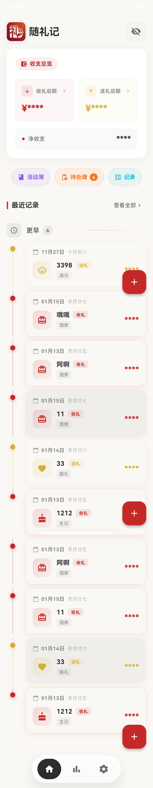
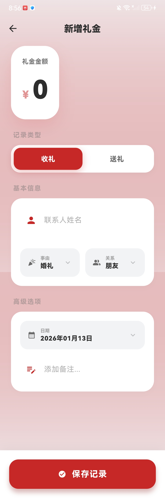
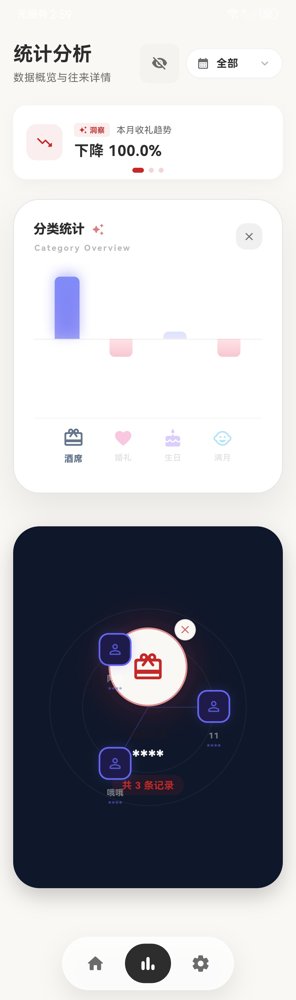
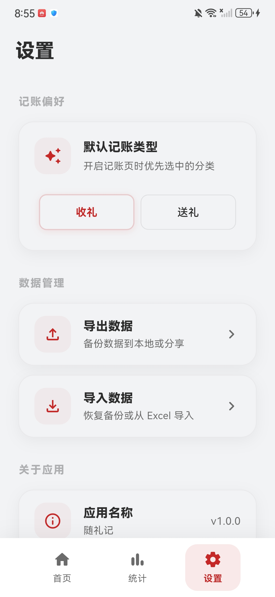

# 📱 随礼记 - 礼金收支追踪管理

一款简洁优雅的礼金收支管理应用，帮助你轻松记录和追踪人情往来。
Android / Windows 版本现已支持 **App 内置更新检查**。

[English](./README_EN.md) | 简体中文

---

## 📑 目录

- [下载安装](#-下载安装)
- [功能特性](#-功能特性)
- [应用截图](#-应用截图)
- [技术栈](#-技术栈)
- [更新日志](#-更新日志)
- [构建指南](#-构建指南)
- [反馈与支持](#-反馈与支持)

---

## 🚀 下载安装

| 平台 | 下载链接 | 说明 |
|------|----------|------|
| **Android** | [📦 APK 下载](https://github.com/final00000000/Gift_Ledger/releases/latest) | 支持 App 内更新；Release 仅提供 ARMv7 / ARM64 两种 APK，不再提供 x86 / x86_64 包 |
| **Windows** | [📦 EXE 安装器下载](https://github.com/final00000000/Gift_Ledger/releases/latest) | 推荐使用安装器升级，支持 App 内拉起安装流程 |
| **Web** | [📦 ZIP 下载](https://github.com/final00000000/Gift_Ledger/releases/latest) | 部署到静态托管 |
| **iOS** | 暂无常驻预编译版本 | 仅支持在 macOS + Xcode 环境本地构建（见 [BUILD.md](./BUILD.md)） |

---

## ✨ 功能特性

- **收支概览**：可视化统计与趋势图表
- **快速记账**：多事由/关系/农历日期支持
- **人情往来**：联系人管理、还礼提醒
- **活动簿**：按活动整理与批量录入
- **数据备份**：Excel/JSON 导出与导入
- **应用更新**：Android / Windows 支持启动自动检查、设置页手动检查、版本忽略与红点提醒

### 更新通道说明

- 默认通道为 **stable**
- 可在设置页手动开启 **beta**
- beta 用户优先接收 beta 版本；若没有更高 beta，则回退检测 stable
- 勾选“这个版本不再提示”后，该版本不再弹窗，但仍保留红点与轻提示

详细说明见：[docs/FEATURES.md](./docs/FEATURES.md)

---

## 📸 应用截图

点击展开查看应用截图

| 首页 | 添加记录 |
|:---:|:---:|
|  |  |

| 数据统计 |
|:---:|:---:|
|  |

| 设置 |
|:---:|
|  |

---

## 🛠️ 技术栈

- **框架**: Flutter 3.2.0+
- **语言**: Dart 2.18.0+
- **数据库**: SQLite (sqflite)
- **UI 设计**: Material Design 3
- **数据导出**: Excel / JSON

---

## 📋 更新日志

**v1.3.2 (2026-03-26)**
- ✨ 列表卡片展示备注摘要与状态标记，补齐自定义内容外显
- ✨ 添加记录页支持多行备注、字数限制与更稳定的备注保存
- ✨ 设置页 / 关于页整合更新入口，支持红点提示与版本忽略
- 🐛 修复取消安装后二次拉起、Windows 安装器构建失败等更新链路问题
- 📦 统一 Android / Windows 发布产物命名、版本规则与更新清单生成，并收敛 Android 发布架构

**v1.2.8 (2026-02-28)**
- 设置页顶部添加 GitHub 跳转按钮
- 构建工具升级（AGP 8.9.1 / Gradle 8.11.1）

👉 [查看完整更新日志](./CHANGELOG.md)

---

## 🔨 构建指南

构建与发布请参考：[BUILD.md](./BUILD.md)

---

## 💬 反馈与支持

- 🐛 [提交 Issue](https://github.com/final00000000/Gift_Ledger/issues)
- ⭐ 如果这个项目对你有帮助，请给我们一个 Star
