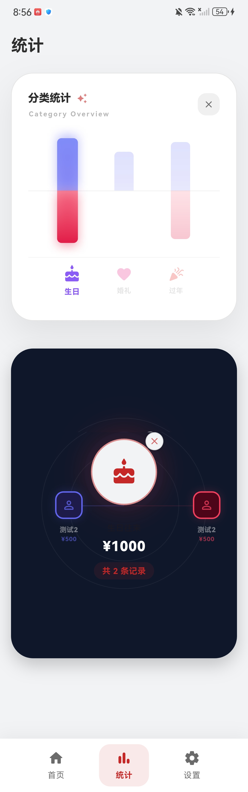

# 📱 Gift Money Tracker

<div align="center">


A simple and elegant gift money tracking app to help you manage social gift exchanges

English | [简体中文](./README.md)

</div>

---

## ✨ Features

### 📊 Data Statistics
- **Balance Overview**: Clear income and expense comparison cards
- **Real-time Balance**: Dynamic calculation of balance
- **Visual Charts**: Intuitive display of income and expense trends

### 📝 Record Management
- **Quick Bookkeeping**: Simple accounting interface with custom amount input
- **Smart Suggestions**: Contact suggestions based on history
- **Flexible Categories**: Wedding, baby shower, housewarming, birthday, funeral, New Year
- **Relationship Tags**: Friends, colleagues, relatives, classmates

### 👥 Contact Management
- **Contact List**: Auto-maintain list of gift exchange contacts
- **Transaction Tracking**: Clear record of amounts for each person
- **Return Reminders**: Smart labels for pending and completed returns
- **Progress Visualization**: Visual progress bars

### 📱 Convenient Features
- **Search & Filter**: Quick search by name or occasion
- **Edit & Delete**: Tap any record to edit or delete
- **Data Backup**: Export to Excel or JSON format
- **Data Recovery**: Import backup files
- **Strict Validation**: Prevent duplicate imports

### 🎨 UI Design
- **Modern UI**: Material Design 3
- **Smooth Animations**: Carefully designed transitions
- **Responsive Layout**: Adapts to different screen sizes

---

## 📸 Screenshots

### Home


### Add Record


### Statistics


### Statistics Details


### Settings


---

## 🚀 Getting Started

### Requirements

- **Flutter SDK**: 3.2.0 or higher
- **Dart SDK**: 2.18.0 or higher

#### Android
- Android SDK: API 21 (Android 5.0) or higher
- Java 17 or higher

#### iOS
- Xcode 14.0 or higher
- CocoaPods 1.11.0 or higher
- macOS 12.0 or higher

### Installation

1. **Clone the repository**
   ```bash
   git clone https://github.com/final00000000/Gift_Ledger.git
   cd Gift_Ledger
   ```

2. **Install dependencies**
   ```bash
   flutter pub get
   ```

3. **Run the app**
   ```bash
   flutter run
   ```

4. **Build release version**
   
   **Android APK**
   ```bash
   flutter build apk --release
   ```
   
   **iOS**
   ```bash
   flutter build ios --release
   ```

---

## 🏗️ Project Structure

```
gift_money_tracker/
├── lib/
│   ├── main.dart                 # App entry point
│   ├── models/                   # Data models
│   ├── screens/                  # Screens
│   ├── services/                 # Business logic
│   ├── widgets/                  # Custom widgets
│   └── theme/                    # Theme configuration
├── android/                      # Android platform code
├── ios/                          # iOS platform code
├── assets/                       # Asset files
└── pubspec.yaml                  # Project configuration
```

---

## 📦 Core Dependencies

| Package | Version | Purpose |
|---------|---------|---------|
| sqflite | ^2.3.0 | Local database storage |
| path_provider | ^2.1.1 | File path access |
| intl | ^0.20.2 | Internationalization |
| file_picker | ^8.0.0 | File picker |
| excel | ^4.0.3 | Excel file I/O |
| share_plus | ^8.0.0 | File sharing |

---

## 🛠️ Tech Stack

- **Framework**: Flutter 3.2.0+
- **Language**: Dart 2.18.0+
- **Database**: SQLite
- **UI Design**: Material Design 3
- **Data Export**: Excel / JSON

---

## 📄 License

This project is licensed under the [MIT License](LICENSE)

---

## 💬 Feedback & Support

- 🐛 [Submit an Issue](https://github.com/final00000000/Gift_Ledger/issues)
- ⭐ Star us if you like this project!

---

<div align="center">
  
### ⭐ Star us if you like this project ⭐

Made with ❤️ by Flutter

</div>
