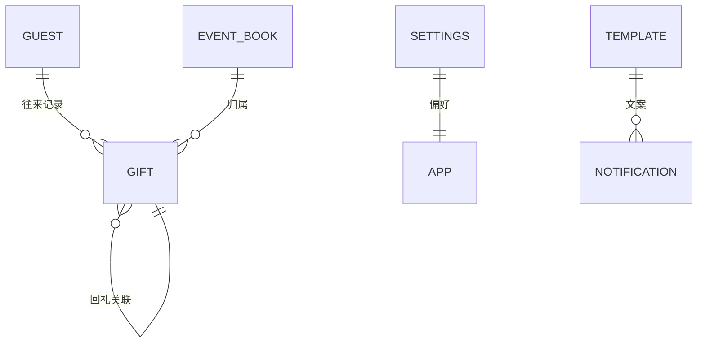
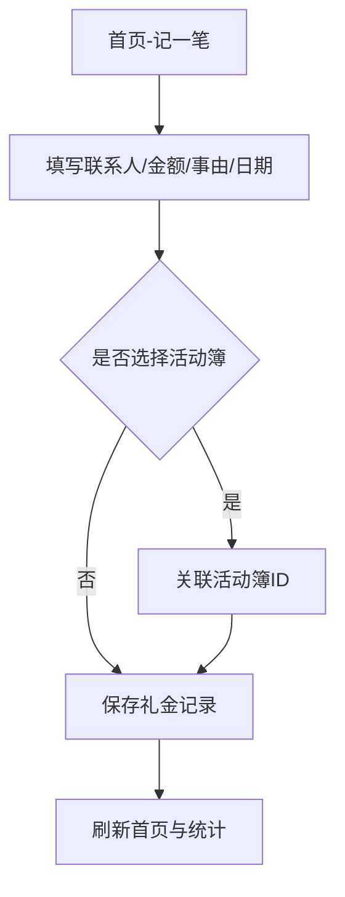
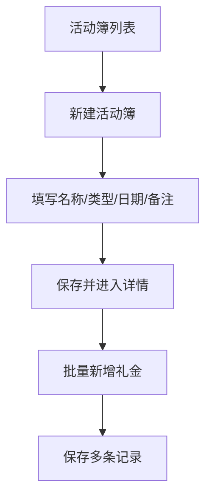
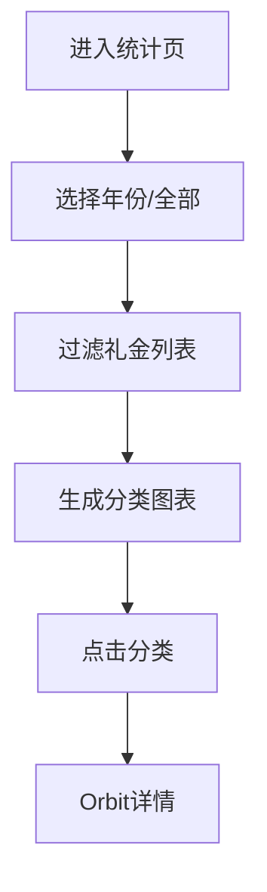
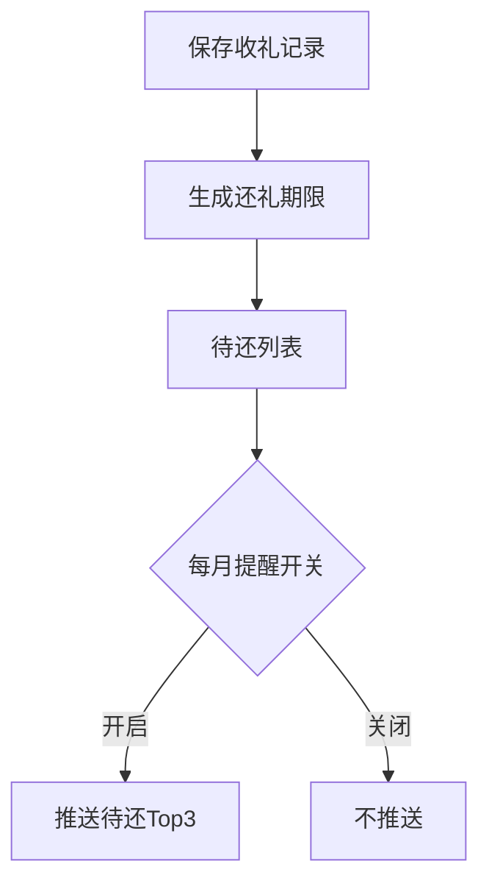
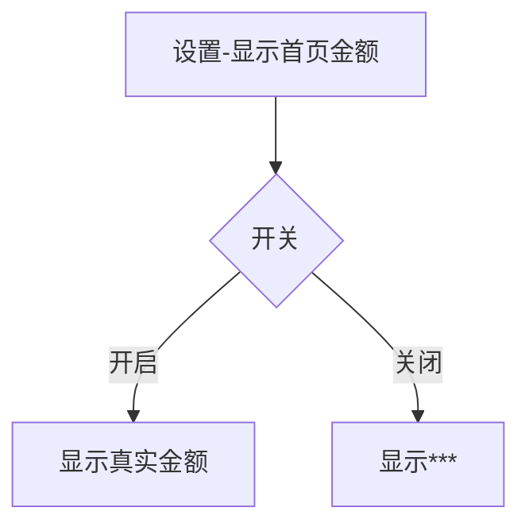

# PRD｜随礼记（Gift Ledger）

**版本**：v0.1  
**状态**：草案  
**日期**：2026-01-15  
**负责人**：产品/研发（AI 辅助生成）

---

## 1. 背景与目标

**背景**：礼金往来记录分散、统计困难、还礼容易遗漏，需要一个轻量、离线、跨平台的个人礼金记账工具。  
**目标**：提供单人使用的礼金收支记录与统计能力，并支持“活动簿”按活动聚合，减少漏记与漏还。

---

## 2. 角色与使用场景

**唯一用户**：记账人（本人）。  
**典型场景**：
- 参加亲友活动后记录收礼/送礼。
- 想按年度或活动查看礼金走势。
- 需要提醒哪些人情尚未归还。
- 需要导出备份或迁移数据。

---

## 3. 范围与边界

### 3.1 范围内
- 礼金记录（收礼/送礼）
- 联系人/关系维护
- 统计视图与分类明细
- 活动簿（自定义活动类型）
- 还礼追踪与提醒
- 本地导入/导出
- 设置项（隐私、统计口径等）

### 3.2 范围外
- 多用户/共享协作
- 云同步/在线账户体系
- 新人信息、地点、场次、预算、主办方等扩展字段

---

## 4. 业务与数据规则

- **收礼对象默认是本人**，不需要记录新人、场地、场次、预算、主办方。
- **礼金记录**必填：联系人、金额、收/送、事由、日期；可选：备注、活动簿。
- **活动簿**必填：名称、类型、日期（含农历）；可选：备注。
- **还礼逻辑**：记录可与另一笔记录形成“回礼关联”，用于状态追踪。
- **统计口径**：可在设置中选择“统计是否包含活动簿”。
- **隐私显示**：首页金额可隐藏为 `***`。

---

## 5. 功能需求

### 5.1 礼金记录
- 新增/编辑/删除礼金记录
- 支持事件类型、日期（公历 + 农历）
- 记录状态：已还/未还
- 批量新增（活动簿内）

**验收标准**：
- 可在首页新增记录并保存成功
- 列表内可编辑/删除
- 记录日期显示公历+农历

### 5.2 联系人与关系
- 自动根据记录生成联系人
- 联系人详情中查看往来统计

### 5.3 统计
- 总收/总送概览
- 分类对称柱状图
- 分类详情（Orbit Map）
- **年度筛选**（全部/具体年份）

**验收标准**：
- 切换年份后图表与明细同步过滤

### 5.4 活动簿
- 新建/编辑/删除活动簿
- 活动簿详情聚合礼金记录
- 支持按活动批量录入
- 活动类型可自定义

### 5.5 还礼提醒
- 还礼追踪状态展示
- 每月推送待还 Top3（可开关）

### 5.6 数据管理
- 导出 Excel/JSON
- 导入备份（防重复）

### 5.7 设置
- 默认收礼模式
- 模糊金额（话术）
- 统计包含活动簿
- 启用活动簿
- **显示首页金额（隐私开关）**

---

## 6. 业务关系图（Mermaid）

---

## 6.1 数据字典（核心实体）

### GIFT（礼金记录）
| 字段 | 类型 | 必填 | 说明 |
| --- | --- | --- | --- |
| id | int | 否 | 主键 |
| guestId | int | 是 | 关联联系人 |
| amount | double | 是 | 金额 |
| isReceived | bool | 是 | 收礼/送礼 |
| eventType | string | 是 | 事由/类型 |
| eventBookId | int | 否 | 关联活动簿 |
| date | DateTime | 是 | 公历日期 |
| note | string | 否 | 备注 |
| relatedRecordId | int | 否 | 回礼关联记录 |
| isReturned | bool | 否 | 是否已还/已收 |
| returnDueDate | DateTime | 否 | 建议还礼日期 |
| remindedCount | int | 否 | 已提醒次数 |

### GUEST（联系人）
| 字段 | 类型 | 必填 | 说明 |
| --- | --- | --- | --- |
| id | int | 否 | 主键 |
| name | string | 是 | 姓名 |
| relationship | string | 是 | 关系标签 |
| phone | string | 否 | 电话 |
| note | string | 否 | 备注 |

### EVENT_BOOK（活动簿）
| 字段 | 类型 | 必填 | 说明 |
| --- | --- | --- | --- |
| id | int | 否 | 主键 |
| name | string | 是 | 活动名称 |
| type | string | 是 | 活动类型（可自定义） |
| date | DateTime | 是 | 公历日期 |
| lunarDate | string | 否 | 农历日期 |
| note | string | 否 | 备注 |
| createdAt | DateTime | 否 | 创建时间 |

### SETTINGS（本地偏好）
| Key | 类型 | 默认值 | 说明 |
| --- | --- | --- | --- |
| default_is_received | bool | true | 默认收礼模式 |
| use_fuzzy_amount | bool | false | 话术模糊金额 |
| stats_include_event_books | bool | true | 统计包含活动簿 |
| event_books_enabled | bool | true | 启用活动簿 |
| show_home_amounts | bool | true | 首页显示金额 |
| notifications_enabled | bool | false | 每月提醒开关 |

## 6.2 隐私与安全策略

- **本地存储**：SQLite + SharedPreferences，默认不上传云端。\n- **隐私显示**：首页金额可隐藏为 `***`。\n- **主动导出**：数据导出/分享必须由用户手动触发。\n- **数据可控**：删除活动簿将级联删除其礼金记录。\n- **设备级安全**：数据保护依赖设备系统安全与锁屏能力。\n 
---

## 6.3 权限说明

- **通知权限**：用于每月待还提醒（可关闭），拒绝后不影响核心记账功能。
- **文件读写权限**：用于导入/导出 Excel 与 JSON，仅在用户触发时使用。
- **分享权限**：用于导出后系统分享面板，不读取用户其他数据。
- **不需要的权限**：联系人、位置、日历、麦克风等均不使用。

## 6.4 异常场景

- **无数据**：首页与统计展示空状态，不报错。
- **年度筛选无记录**：显示空状态并保持页面可刷新。
- **导入失败/重复**：提示错误信息，数据不落库。
- **删除活动簿**：二次确认，级联删除不可恢复。
- **通知权限拒绝**：提示用户，提醒功能自动降级为关闭。
- **数据库错误**：展示“加载失败”提示并允许重试。

## 6.5 边界用例

- **金额限制**：金额必须大于 0；整数位最多 8 位，小数位最多 2 位。
- **活动簿名称**：长度不超过 30 个字。
- **日期范围**：日期选择范围为 2000-01-01 至 2101-12-31。
- **活动簿可选**：礼金记录可不选择活动簿。

---

## 6.6 非功能指标

- **启动时长**：冷启动 < 3s（中端设备基准）。\n- **首页加载**：核心数据 < 500ms（本地数据库）。\n- **滚动/切换**：页面切换与列表滚动无明显卡顿（>= 50 FPS）。\n- **存储规模**：支持 10 万条礼金记录以内稳定使用。\n- **离线可用**：核心功能无网络依赖。\n
## 6.7 可观测性与诊断

- **日志级别**：仅记录错误与异常（不记录个人信息）。\n- **错误提示**：用户可见的失败提示包含原因与重试入口。\n- **导入导出**：导入失败可输出简要错误原因。\n- **崩溃追踪**：保留本地崩溃日志（不上传）。\n
---

## 7. 业务流程（概要）

1. 新建记录 → 选择联系人/事由/金额/日期 → 保存
2. 新建活动簿 → 批量录入礼金 → 统计可按活动查看
3. 统计页选择年度 → 查看分类汇总 → 深入详情
4. 还礼追踪 → 查看待还 → 触发提醒

### 7.1 新增礼金记录

### 7.2 活动簿批量录入

### 7.3 年度统计筛选

### 7.4 还礼提醒

### 7.5 首页金额隐私

---

## 8. 非功能性要求

- **离线优先**：本地 SQLite 存储
- **性能**：首页并行加载，滚动与切换不卡顿
- **隐私**：首页金额可隐藏、导出需用户主动触发
- **兼容**：Android / iOS / Windows / Web

---

## 9. 验收标准（总体）

- 核心功能可离线完成（记录/统计/活动簿/导入导出）
- 年度筛选与活动簿统计口径正确
- 隐私开关生效：首页金额可隐藏为 `***`
- 设置项更改后首页与统计同步更新

---

## 10. 版本规划（建议）

- **v1.2.0**：活动簿、批量录入、月度提醒
- **v1.2.1**：年度筛选、隐私开关、UI 细节优化
- **v1.3.0**：统计维度扩展、更多可视化
