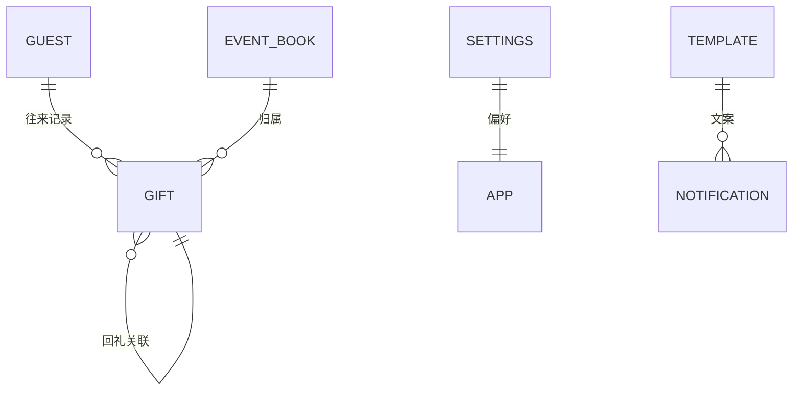
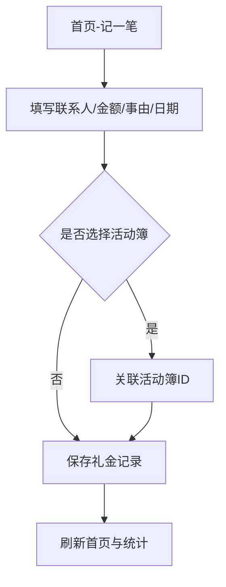
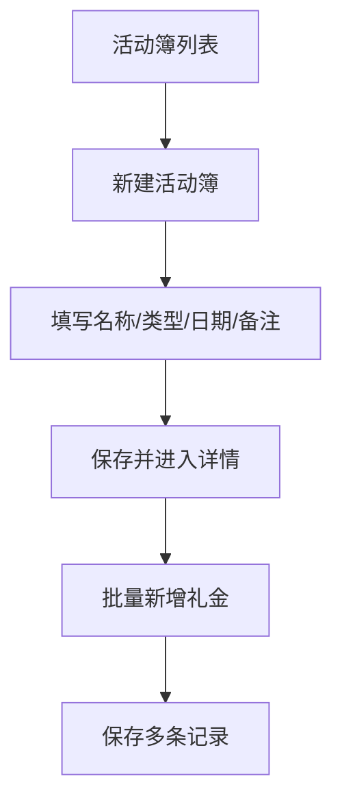
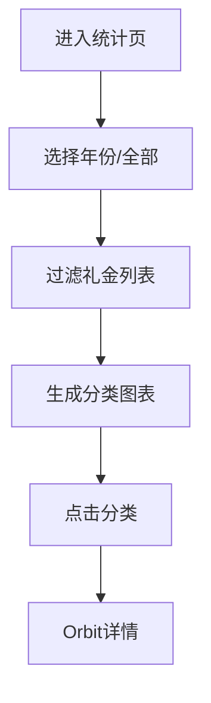
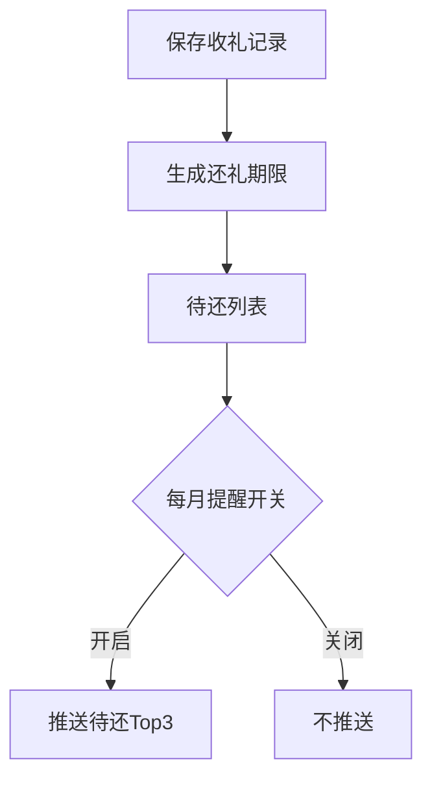
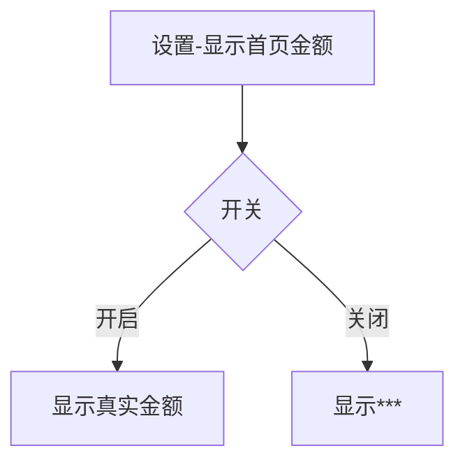

# 业务关系图｜随礼记（Gift Ledger）

## 说明
- **GUEST**：联系人
- **GIFT**：礼金记录
- **EVENT_BOOK**：活动簿（婚礼/满月/乔迁等自定义活动）
- **SETTINGS**：用户设置（隐私/统计口径等）
- **TEMPLATE/NOTIFICATION**：提醒话术与通知

## 关键流程

### 1. 新增礼金记录

### 2. 活动簿批量录入

### 3. 年度统计筛选

### 4. 还礼提醒

### 5. 首页金额隐私

